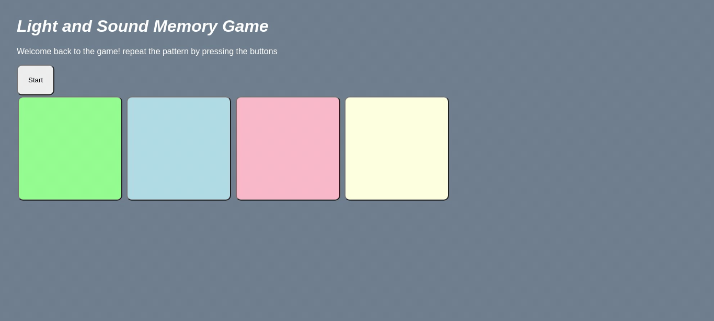

# Pre-work - *First Game*

**Light & Sound Memory game** is a Light & Sound Memory game to apply for CodePath's SITE Program. 

Submitted by: **Caleb Mugisha**

Time spent: **4.5** hours spent in total

## Required Functionality

The following **required** functionality is complete:

* [x] Game interface has a heading (h1 tab), a line of body text (p tag), and four buttons that match the demo app
* [x] "Start" button toggles between "Start" and "Stop" when clicked. 
* [x] Game buttons each play a sound when clicked. 
* [x] Computer plays back sequence of clues including sound and visual cue for each button
* [x] Play progresses to the next turn (the user gets the next step in the pattern) after a correct guess. 
* [x] User wins the game after guessing a complete pattern

The following **optional** features are implemented:

* [x] Any HTML page elements (including game buttons) has been styled differently than in the tutorial
* [x] Buttons use a pitch (frequency) other than the ones in the tutorial
* [ ] More than 4 functional game buttons
* [ ] Playback speeds up on each turn
* [ ] Computer picks a different pattern each time the game is played
* [ ] Player only loses after 3 mistakes (instead of on the first mistake)
* [ ] Game button appearance change goes beyond color (e.g. add an image)
* [ ] Game button sound is more complex than a single tone (e.g. an audio file, a chord, a sequence of multiple tones)
* [ ] User has a limited amount of time to enter their guess on each turn

The following **additional** features are implemented:

- [ ] List anything else that you can get done to improve the app!

## Video Walkthrough

Here's a walkthrough of implemented user stories:

GIF created with [LiceCap](http://www.cockos.com/licecap/).

## Reflection Questions
1. If you used any outside resources to help complete your submission (websites, books, people, etc) list them here. 
[I DIDN'T USE ANY]

2. What was a challenge you encountered in creating this submission (be specific)? How did you overcome it? (recommended 200 - 400 words) 
[THIS BEING MY FIRST ENCOUNTER WITH WEB DEVELOPMENT TOOLS;  I THEREFORE HAD TO PUSH MYSELF	TO UNDERSTAND WHAT THE CODE MEANT, AN EXAMPLE I CAN GIVE IS ABOUT HOW THE DIFFERENT SOUND TONES WERE PRODUCED( I COULDN'T GET MY HEAD AROUND THAT) 
AND AFTER I DID, I TRIED GENERATING RANDOM DIGITS IN THAT ARRAY; HOWEVER, IT WAS ABOVE MY CAPABILITIES. 
THE OTHER CHALLENGE WAS UNDERSTANDING HOW THE DOM WORKS; IT TOOK ME A CONSIDERABLE AMOUNT OF TIME TO GET MY HEAD AROUND IT.
OTHER THAN THAT THE PROCESS WAS SMOOTH  OFCOURSE AFTER REVIEWING THE CODE MULTIPLE TIMES FOR  A BETTER UNDERSTANDING.

3. What questions about web development do you have after completing your submission? (recommended 100 - 300 words) 
[TO THIS MOMENT I HAVE NO QUESTIONS ON MY MIND; I BELIEVE WITH MORE EXERCISES AND PROJECTS, THE CODE WILL BE MUCH DIGESTIBLE.]

4. If you had a few more hours to work on this project, what would you spend them doing (for example: refactoring certain functions, adding additional features, etc). Be specific. (recommended 100 - 300 words) 
[AS ALREADY STATED, I TRIED TO GENERATE RANDOMLY AN ARRAY OF HOW THE BUTTONS SHOULD BE PLAYED.
WITH MORE TIME AND EXPERIENCE I WOULD DEFINITELY TRY TO IMPROVE THAT! 
SECOND OF ALL  I WOULD ALSO MAKE THE SOUND GENERATE RANDOMLY AS LONG AS IN A PREDEFINED STATED RANGE, SO THAT THE GAME DOESN'T SOUND THE SAME EVERY TIME A USER RESTARTS IT]

## License

    Copyright [yyyy] [name of copyright owner]

    Licensed under the Apache License, Version 2.0 (the "License");
    you may not use this file except in compliance with the License.
    You may obtain a copy of the License at

        http://www.apache.org/licenses/LICENSE-2.0

    Unless required by applicable law or agreed to in writing, software
    distributed under the License is distributed on an "AS IS" BASIS,
    WITHOUT WARRANTIES OR CONDITIONS OF ANY KIND, either express or implied.
    See the License for the specific language governing permissions and
    limitations under the License.
